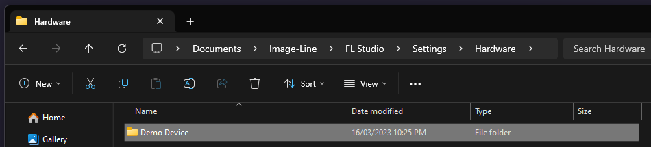
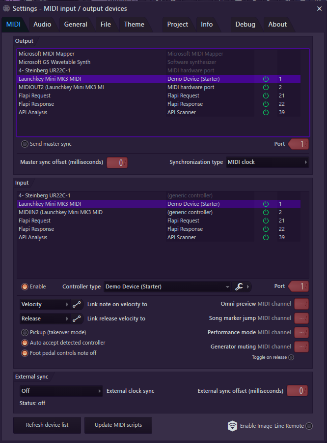

# Getting started with MIDI Controller Scripting

!!! NOTE
    This tutorial is for writing your own MIDI Controller Scripts. If you're
    looking to install an existing script, check out [this tutorial](./installing_scripts.md)
    instead.

If you use a MIDI controller with FL Studio, it can be frustrating when it
doesn’t work correctly out of the box. Fortunately, FL Studio includes a
feature called MIDI Controller Scripting, which lets us add support for any
MIDI device that FL Studio is capable of communicating with.

This tutorial covers some basic features of MIDI Controller Scripting and walks
you through the process of writing a simple script that links transport
buttons on your MIDI Controller to control FL Studio. While this tutorial
doesn't expect much knowledge of programming or the Python programming
language, you'll need to learn these if you want to take your program further.

The specific controller I will be writing a script for is the Novation
Launchkey Mini Mk3, but the steps should apply for any MIDI controller.

## First steps

Before you get started, there are a couple of things you should do to get
yourself set up.

* Check the [working script list](https://forum.image-line.com/viewtopic.php?t=228179)
  on the [Image-Line forums](https://forum.image-line.com/) to see if your
  controller is already supported by an existing script.

* If you're planning on sharing your script with others, consider resetting
  your controller to its factory defaults or exporting its settings to a file
  using its configuration program. This is important since otherwise your
  script may not work for others.

* Install a code editor to work effectively with your code. A great option is
  [Visual Studio Code](https://code.visualstudio.com), which offers excellent
  support for any features you'll need when working on MIDI Controller Scripts.

* Install [Python](https://python.org) and then follow the
  [installation instructions](/installation.md) in order to get intelligent
  suggestions and documentation as you write your code.

## Creating a device folder

Open up your MIDI Controller Scripts folder. This can be found within your
Image-Line data directory at `Image-Line/FL Studio/Settings/Hardware`. From
there, create a new folder based on the name of your script. For example, I
called my one `Demo device`.

| Platform | Example |
|----------|---------|
| Windows  |  |
| MacOS    | ***TODO*** |

## Starter code

Open your new folder in your text editor of choice. In VS Code, you can use
`File > Open Folder` then select the folder you created.

From there, create a new Python file with the name of your device, based on
this template: `device_[name].py`. For example, I named my file
`device_launchkey.py`.

Open this file and copy the starter code across.

??? code "Click to view the starter code"

    ```py linenums="1"
    # name=Demo Device (Starter)
    # url=TODO
    """
    This is a simple starter script that provides some tooling to simplify the
    process of creating a MIDI script to add basic support to your MIDI
    controllers.

    Authors:
    * Miguel Guthridge
    * Your Name
    """


    def OnMidiIn(event):
        """
        Called whenever your device sends a MIDI message to FL Studio
        """
        # TODO: follow the tutorial to add logic for handling events here

        # Print out the information about this event
        print_event(event)


    def print_event(event):
        """
        Prints information about MIDI events

        You shouldn't need to modify this function. If this code doesn't make sense
        to you, that is ok, since it is beyond the scope of the tutorial.
        """
        # If there is sysex data in the event, tell the user that we don't cover
        # that in this tutorial
        if event.sysex is not None:
            sysex = event.sysex
            print(f"Event: sysex={[hex(b) for b in sysex]}")
            print("Note that sysex events are somewhat more complex than standard "
                "events, and are beyond the scope of the tutorial.")
        # Otherwise print out the info
        else:
            # Assign variables to get the info
            status = event.status
            data1 = event.data1
            data2 = event.data2
            handled = event.handled
            # Then use a formatted string to print out the info in a readable
            # format
            print(f"Event: {status=:3}, {data1=:3}, {data2=:3}, handled={bool(handled)}")

        # Add an extra blank line for readability
        print()
    ```

### A look at the starter code

Let's take a moment to familiarize ourselves with this code. Don't worry if you
don't understand all of it - as long as you grasp the basics, you'll be fine!

```py  linenums="1"
# name=Demo Device (Starter)
# url=TODO
```

These lines contain information about the name and help URL for your script.
You should set the `name` to be the name of your MIDI controller, and you can
set the `url` to any URL within the Image-Line forums - once you've finished
your script, you can make this link to your post where you share your awesome
work!

Below them, you can see documentation which you can edit to contain information
about your work, such as how to use it, as well as the author and copyright
information.

After this is the definition for the `OnMidiIn` function. You can see it is
documented as `Called whenever your device sends a MIDI message to FL Studio`,
and contains some comments as well as a single call to `print_event`.

```py  linenums="14"
def OnMidiIn(event):
    """
    Called whenever your device sends a MIDI message to FL Studio
    """
    # TODO: follow the tutorial to add logic for handling events here

    # Print out the information about this event
    print_event(event)
```

This is the function we'll be modifying in order to make our script handle
incoming events.

Finally, we have a definition for `print_event`, which is a function that we'll
use to display information about incoming events. Note that there is no need
to understand this function, but if you're interested, it is thoroughly
commented to explain how it works.

```py linenums="24"
def print_event(event):
    ...
```

### Assigning your device to the script

We should now assign our script to work with FL Studio. Launch FL Studio, or if
it was already open, close it an re-open it. Then, open the MIDI Settings and
find your device in the lists of inputs and outputs.

Set the port number for your device's inputs and outputs to numbers of your
choice. The value shouldn't matter as long as it is unique, and the input port
matches the output port for each device.

Then, with the input selected, you should use the script drop-down to select
your script. This should have the same name as you entered in the comment
earlier.

If your device has two MIDI ports, try assigning the script to the first port,
as this is more likely to be the one that receives the messages you need.

This screenshot contains the setup I used to get my device working correctly.



To validate your setup, you should now open `View > Script output` and select
your MIDI Controller from the tabs. If it is working correctly, you should see
output appear as you press buttons on your controller.

!!! info "Expected output"

    ```txt
    FL Studio Midi scripting version: 35
    "C:\Users\migue\Documents\Image-Line\FL Studio\Settings\Hardware\Demo Device\device_demo.py"
    Event: status=191, data1=115, data2=127, handled=False

    Event: status=191, data1=115, data2=  0, handled=False
    ```

## Writing our script

Now it's time to start programming. We can use the output from our script to
get the information we need to be able to link up all the buttons on our
controller. If the output ever gets too cluttered, you can always click the
`Clear output` button in the bottom left of the output window.

### Investigating our device

Try pressing and releasing the play button of your device. On many controllers,
including mine, this will send two events - one for when you press the button,
and another for when you release it.

```txt
Event: status=191, data1=115, data2=127, handled=False
Event: status=191, data1=115, data2=  0, handled=False
```

If your device didn't send any MIDI messages, you should try assigning your
script to a different MIDI port in FL Studio's MIDI settings.

Each event can often be identified using the `status` and `data1` values, with
`data2` containing additional information about the event, and my controller is
no different: the play button is identified as `status=191, data1=115`, with
`data2=127` for a press and `data2=0` for a release.

Write your results down so you can use them later.

### Linking the play button

Let's write some code that can identify the play button. We can add an `if`
statement to our `OnMidiIn` function so that it matches events with the right
`status` and `data1` values to be a play button.

Inside this `if` statement, you can see we call the `print` function, which is
used to write information to the script output. In this case, we are printing
`"You pressed the play button"`.

```py  linenums="14"
def OnMidiIn(event):
    """
    Called whenever your device sends a MIDI message to FL Studio
    """
    if event.status == 191 and event.data1 == 115:
        print("You pressed the play button")

    # ... rest of the code
```

!!! warning "Careful"

    Be sure to add a colon `:` at the end of your `if` statement, and to use a
    `==` (double equals) operator to check if the values match.

After you've written similar code to match the play button, try pressing
`Reload script` in the script output. Now each time you press the play button,
it should display that you did in the output.

```txt
You pressed the play button
Event: status=191, data1=115, data2=127, handled=False
```

Great! Now all we need to do is link it to a feature in FL Studio. To access FL
Studio's playback and other transport features, we need to `import` the
[`transport`][transport] module. Right after your opening documentation, add
the following code to access this module.

```py linenums="12"
import transport
```

Now instead of `print`ing information, we can instead start playback when our
user hits the play button. Modify your `if` statement so that it calls
[`transport.start()`][transport.start] instead of `print`.

```py  linenums="14"
def OnMidiIn(event):
    """
    Called whenever your device sends a MIDI message to FL Studio
    """
    if event.status == 191 and event.data1 == 115:
        transport.start()

    # ... rest of the code
```

After you reload your script, try slowly pressing and releasing the play
button. Notice that FL Studio only plays while the button is pressed down. This
is because a second call to [`transport.start()`][transport.start] pauses
playback when the button gets lifted. Let's fix this by adding an additional
check to ensure that we only start playback when the button gets pressed.

```py  linenums="14"
def OnMidiIn(event):
    """
    Called whenever your device sends a MIDI message to FL Studio
    """
    if event.status == 191 and event.data1 == 115:
        # Note that we are checking if `data2` is greater than zero -- this is
        # because some controllers could send other values to indicate a press,
        # especially if the button is velocity-sensitive.
        if event.data2 > 0:
            transport.start()

    # ... rest of the code
```

Hit reload and try again -- it should work now! Finally, let's tell FL Studio
that it's safe to ignore the event, since we have handled it. To do this, you
can set [`event.handled = True`][fl_classes.FlMidiMsg.handled]. Let's also add
a comment to remind us that this code is for the play button, so that we can
remember what it is for if we come back to this code in the distant future.

```py  linenums="14"
def OnMidiIn(event):
    """
    Called whenever your device sends a MIDI message to FL Studio
    """
    # PLAY BUTTON
    if event.status == 191 and event.data1 == 115:
        if event.data2 > 0:
            transport.start()
        # Notice that I mark the event as handled, even for releases of the
        # button -- we don't want FL Studio to do anything about those.
        event.handled = True

    # ... rest of the code
```

### Linking the record button

Now that we've got the play button handled, let's link the record button. Since
we know that if the user pressed the play button, their button press won't have
been the record button, we can use an `elif` statement to make our check
exclusive to the play button.

Perform the steps from [investigating our device](#investigating-our-device)
again on the record button, and take note of your results. For me, the event
was identified as `status=191, data1=117`.

Then, you can handle the record button by calling
[`transport.record()`][transport.record]. We'll use similar logic to ignore
button releases, and to mark the event as handled.

```py  linenums="14"
def OnMidiIn(event):
    """
    Called whenever your device sends a MIDI message to FL Studio
    """
    # PLAY BUTTON
    if event.status == 191 and event.data1 == 115:
        if event.data2 > 0:
            transport.start()
        event.handled = True
    # RECORD BUTTON
    elif event.status == 191 and event.data1 == 117:
        if event.data2 > 0:
            transport.record()
        event.handled = True

    # ... rest of the code
```

Once again, test your work by hitting save, then reloading the script in FL
Studio.

### Linking fast-forward and rewind

Fast-forward and rewind buttons usually behave slightly differently to other
buttons. This is because they should only be active when they are pressed down,
and should stop once they are lifted. To accomplish this, we can add an `else`
statement after our check for the `data2` value.

For the fast-forward button, we should call [`transport.fastForward(2)`][transport.fastForward]
when the button is pressed to start fast-forwarding, and then
`transport.fastForward(0)` when it is released to stop.

```py  linenums="14"
def OnMidiIn(event):
    """
    Called whenever your device sends a MIDI message to FL Studio
    """
    # PLAY BUTTON
    if event.status == 191 and event.data1 == 115:
        if event.data2 > 0:
            transport.start()
        event.handled = True
    # RECORD BUTTON
    elif event.status == 191 and event.data1 == 117:
        if event.data2 > 0:
            transport.record()
        event.handled = True
    # FAST FORWARD BUTTON
    elif event.status == 191 and event.data == 113:
        if event.data2 > 0:
            transport.fastForward(2)
        else:
            transport.fastForward(0)
        event.handled = True

    # ... rest of the code
```

Finally, we can use similar logic for the rewind button by calling
[`transport.rewind`][transport.rewind] instead.

This is all that we'll be implementing in this tutorial.

??? code "Click to reveal the finished code"

    ```py linenums="1"
    # name=Demo Device (Complete)
    # url=https://www.youtube.com/watch?v=dQw4w9WgXcQ
    """
    This is a simple starter script that provides some tooling to simplify the
    process of creating a MIDI script to add basic support to your MIDI
    controllers.

    Authors:
    * Miguel Guthridge
    """
    import transport

    def OnMidiIn(event):
        """
        Called whenever your device sends a MIDI message to FL Studio
        """

        # PLAY BUTTON
        if event.status == 191 and event.data1 == 115:
            # If event.data2 is greater than zero, that means they're pressing the
            # button, so we should start playback
            if event.data2 > 0:
                transport.start()
            # Let's mark the event as handled either way, so that FL Studio doesn't
            # also try to handle it for us
            event.handled = True

        # RECORD BUTTON
        elif event.status == 191 and event.data1 == 117:
            if event. data2 > 0:
                transport.record()
            event.handled = True

        # FAST FORWARD BUTTON
        elif event.status == 191 and event.data1 == 113:
            if event. data2 > 0:
                transport.fastForward(2)
            else:
                transport.fastForward(0)
            event.handled = True

        # REWIND BUTTON
        elif event.status == 191 and event.data1 == 112:
            if event. data2 > 0:
                transport.rewind(2)
            else:
                transport.rewind(0)
            event.handled = True

        # Print out the information about this event
        # IMPORTANT: This is commented out as printing information continuously
        # can be quite laggy

        # print_event(event)


    def print_event(event):
        """
        Prints information about MIDI events

        You shouldn't need to modify this function. If this code doesn't make sense
        to you, that is ok, since it is beyond the scope of the tutorial.
        """
        # If there is sysex data in the event, tell the user that we don't cover
        # that in this tutorial
        if event.sysex is not None:
            sysex = event.sysex
            print(f"Event: {sysex=}")
            print("Note that sysex events are somewhat more complex than standard "
                "events, and are beyond the scope of the tutorial.")
        # Otherwise print out the info
        else:
            # Assign variables to get the info
            status = event.status
            data1 = event.data1
            data2 = event.data2
            handled = event.handled
            # Then use a formatted string to print out the info in a readable
            # format
            print(f"Event: {status=:02}, {data1=:02}, {data2=:02}, {handled=}")

        # Add an extra blank line for readability
        print()
    ```

## Where to from here?

There are so many more things you can do with MIDI Controller Scripting. Here
are some ideas:

* Learn more Python so you can write more advanced and powerful scripts.
  ([This video](https://www.youtube.com/watch?v=rfscVS0vtbw) is an excellent
  resource).

* Link more of your controller's buttons to FL Studio. For inspiration, some
  functions you could look at are [`transport.setLoopMode()`][transport.setLoopMode],
  [`ui.next()`][ui.next], and [`ui.previous()`][ui.previous].

* Configure your script so that it gets [set up automatically](./automatic_script_setup.md)
  by FL Studio when a compatible device is connected.

* Look for a "programmer's manual" for your device, which will have essential
  information required for taking full control of your device. Not all devices
  have these, but they are invaluable when they are made available, so it is
  worth looking.

* Use the functions in the [`device`][device] module to send MIDI messages back
  to your device, potentially allowing you to control its LEDs and screen.

* Share your hard work with the world: check out the
  [sharing your script tutorial](./sharing_scripts.md) for instructions.

* Enjoy your device's new integration with FL Studio.
