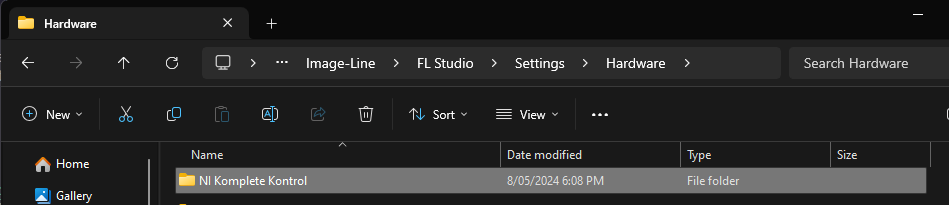
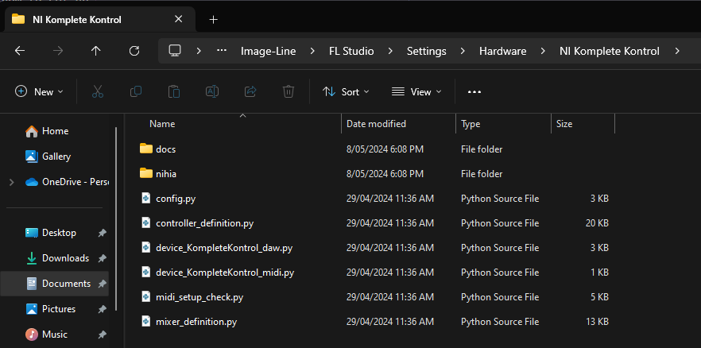

# Installing MIDI Controller Scripts

Before you can use 3rd-party scripts, you'll need to install them so that FL
Studio can find them. This tutorial explains the basic steps for how to set up
scripts to use them with FL Studio.

Note that many official (OEM) scripts are automatically downloaded and
installed by FL Studio, and so following these instructions isn't necessary for
them.

## Download the script

Once you've found a compatible script from the
[working scripts list](https://forum.image-line.com/viewtopic.php?p=1494169#p1494169),
download its files. Most forum posts either attach the script files, or provide
a download link. In most cases, the download will be a `.zip` archive, or a
Python script file (`.py`).

## Create the script folder

Launch the file explorer program, and navigate to
`Image-Line/FL Studio/Settings/Hardware`. By default, the `Image-Line`
[user data folder](https://www.image-line.com/fl-studio-learning/fl-studio-online-manual/html/envsettings_files.htm#userdata)
is placed within your documents.

Within this folder, create a folder to place your script. It is recommended to
set up a folder with the same name as your MIDI controller to make it easier
to find later. For example, in this screenshot, we have created a script folder
for devices which use Native Instruments' Komplete Kontrol system.

Keep your file explorer opened to your "script folder", as you will add files
there later.

## Extracting the script

Open a separate file explorer window, and navigate to your downloads folder.

If you have downloaded a (`.py`) Python script file, move it into your script
folder.

If you downloaded a `.zip` file, open it, and check its contents. If it
contains a folder (but no top-level files), navigate into that folder. Then,
select the full contents of the archive and move them to your script folder.

In this example, the script contained two folders `docs` and `nihia`, as well
as numerous Python files. All of them have been copied to the script folder.

## Configuring the script in FL Studio

Now that your script is installed, it's time to set it up. Launch FL Studio, or
if it is already running, close and re-open it. Open the MIDI settings.

Some scripts support [automatic setup](./automatic_script_setup.md) within FL
Studio. If you notice that your MIDI controller already works as intended,
there's no need to do anything more, you're all set!

For scripts that don't support automatic setup, you will need to assign your
MIDI controller's inputs and outputs to a port.

Within this screenshot, notice how the "Novation Launchkey Mk3 MIDI" is set to
use port number 1 in both the **input** and **output** sections.

After you have configured your device's input and output ports, you should
select the script to use for your device. Select your controller within the
"Inputs" selection, then use the "Controller type" drop-down to select your
chosen script. For example, in the above screenshot, the controller type is
set to "Demo Device (Starter)".

Now your device should be working correctly with your script. If it isn't, make
sure to check for any device-specific setup instructions. For example, some
devices have a "MIDI" port and a "DAW" port, and require different scripts for
each one.
